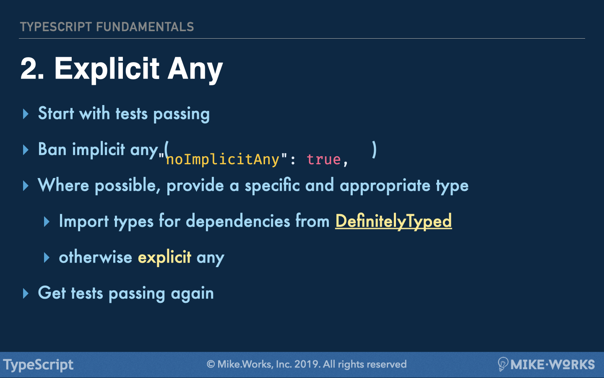
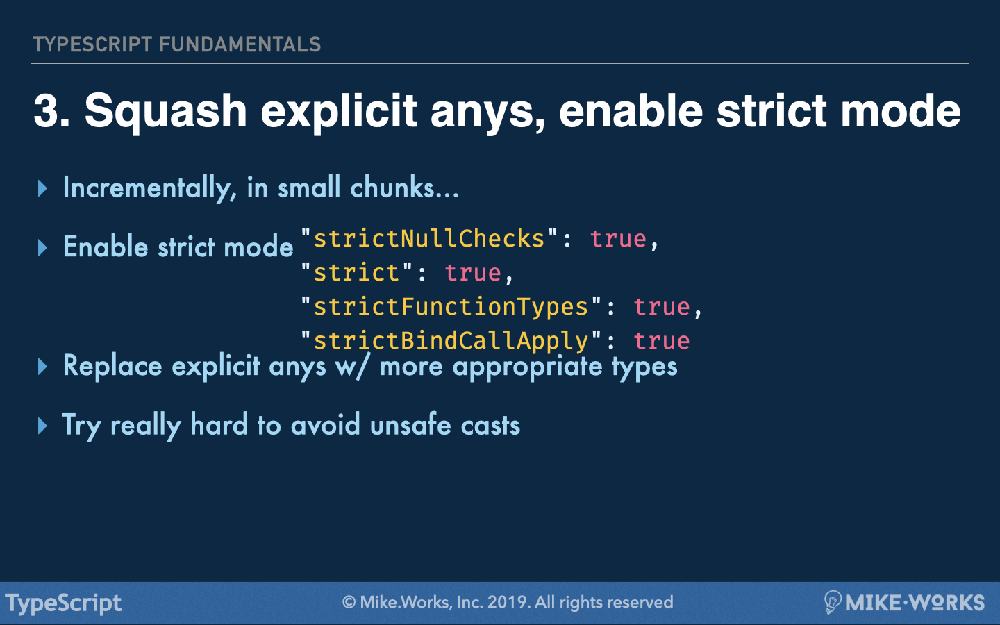

<p align='left'>
 <a href="05-what-have-I-done.md">◀ Back: ...What have I done?</a>
</p>

---

# Converting to TypeScript

In my [TS Fundamentals Course (v2)](https://drive.google.com/file/d/170oHzpLNeprUa-TMmOAnSU4caEFDSb3e/view) we discuss a procedure for progressively converting a codebase from JS to TS.

<p align='center'>


</p>
<p align='center'>


</p>
<p align='center'>



</p>
<p align='center'>



</p>

Putting aside that the last image above is a bit redundant (with `"strict"` enabling `"strictNullChecks"`, `"strictFunctionTypes"` and `""strictNullChecks"` already), there's a lot of work to unpack here

Realistically, this should be done in separate steps for a large codebase

For example:

- 3.1) strict mode

```diff
--- a/tsconfig.json
+++ b/tsconfig.json
  "compilerOptions": {
+   "strict": true,
  }
```

- 3.2) more strict mode

```diff
--- a/tsconfig.json
+++ b/tsconfig.json
  "compilerOptions": {
+   "noUnusedLocals": true,
+   "noImplicitReturns": true,
+   "stripInternal": true,
+   "types": [],
+   "forceConsistentCasingInFileNames": true
  }
```

- 3.3) TS-specific linting

```diff
--- a/.eslintrc
+++ b/.eslintrc
+ "parser": "@typescript-eslint/parser",
  "extends": [
+   "prettier/@typescript-eslint",
+   "plugin:@typescript-eslint/recommended",
+   "plugin:@typescript-eslint/recommended-requiring-type-checking"
  ],
```

- 3.4) Even more strict mode

```diff
--- a/.eslintrc
+++ b/.eslintrc
  "rules": {
+   "@typescript-eslint/no-unsafe-assignment": "off",
+   "@typescript-eslint/no-unsafe-return": "off",
+   "@typescript-eslint/no-explicit-any": "off"
  }
```

There are steps beyond this conversion that are important in order to mitigate some other risks. We'll get into those later

# CHALLENGE: Follow steps 1 and 2 to convert the workshop chat app from JS to ts

## Some Quick Tricks

```sh
# rename all JSX files in src/ to TSX
find src -name '*.jsx' -exec bash -c 'git mv "$0" "${0%.jsx}.tsx"' "{}" \;
# rename all JS files in src/ to TS
find src -name '*.js' -exec bash -c 'git mv "$0" "${0%.js}.ts"' "{}" \;
# rename all JSX files in src/ to TSX
find tests -name '*.jsx' -exec bash -c 'git mv "$0" "${0%.jsx}.tsx"' "{}" \;
# rename all JSX files in src/ to TSX
find tests -name '*.jsx.snap' -exec bash -c 'git mv "$0" "${0%.jsx.snap}.tsx.snap"' "{}" \;
# rename all JS files in tests/ to TS
find tests -name '*.js' -exec bash -c 'git mv "$0" "${0%.js}.ts"' "{}" \;
```

and don't forget to make this small change to [`/index.html`](/index.html)

```diff
--- a/index.html
+++ b/index.html
@@ -8,6 +8,6 @@
   </head>
   <body class="font-sans antialiased h-screen">
     <div id="appContainer" class="w-full h-full"></div>
-    <script src="src/index.js" type="text/javascript"></script>
+    <script src="src/index.ts" type="text/javascript"></script>
   </body>
 </html>
```

and this change to tsconfig for step 1

```diff
--- a/tsconfig.json
+++ b/tsconfig.json
@@ -3,9 +3,10 @@
     "target": "ES2018",
     "allowJs": true,
     "module": "commonjs" /* Specify module code generation: 'none', 'commonjs', 'amd', 'system', 'umd', 'es2015', 'es2020', or 'ESNext'. */,
-    "strict": true /* Enable all strict type-checking options. */,
+    // "strict": true /* Enable all strict type-checking options. */,
     "forceConsistentCasingInFileNames": true,
     "noEmit": true,
+    "noImplicitAny": false,
     "outDir": "dist",
     "declaration": true,
     "jsx": "react",
```

## Other tips

- Most react components can be typed as `React:FunctionComponent<any>`

---

<p align='right'>
 <a href="./03-app-vs-library-concerns.md">Next: App vs. Library Concerns ▶</a>
</p>
