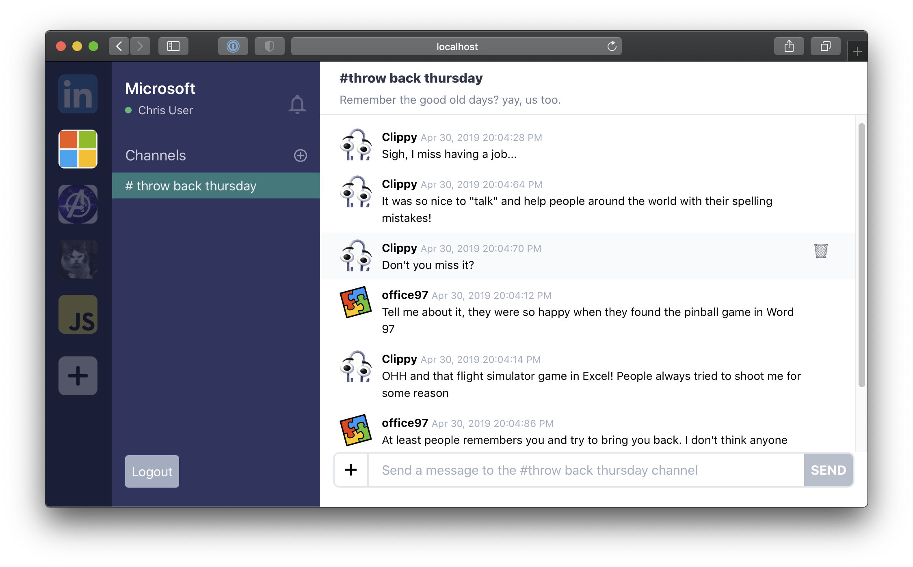

## About the Instructor

- [Frontend Masters instructor](https://frontendmasters.com/teachers/mike-north/) for 9 years
- Developer Platform Lead @ [Stripe](https://stripe.com)
- Designs [Stripe's API semantics](https://stripe.com/docs/api)
- Architect responsible for TypeScript projects like [node-stripe](https://github.com/stripe/stripe-node), [Stripe Shell](https://stripe.sh/), and [Stripe Workbench](https://workbench.stripe.dev/)

## What's this course all about

Enterprise software just means software intended _for large organizations_. How large? For the purposes of this course, let's say big enough that

- No one person could possibly master the entire codebase
- Multiple teams are involved in the evolution of the project, and they don't want to be tightly coupled with each other
- If everyone "does their own thing" the codebase (and resultant product) will lose cohesion and become unmanageable

In essence

> Lots of teams, working on lots of code

Being in this situation requires that we pay extra attention to a few areas.

- **Productivity**. A broken build, an incompatible dependency, etc... interrupts the work of many people.
- **A balance opinionated foundations, and flexibility**. There need to be helpful forces that keep the project cohesive, while still providing enough flexibility for creative license, and customizations to meet certain needs in specific areas of the codebase.
- **Designing for a long shelf life**. Successful large projects are often around for a long time. They need to be able to evolve as things change, and avoid the need for a rewrite every few years
- **Managing complexity**. Once a codebase gets large enough, managing the interactions between different areas starts to become overwhelming if the architecture is not designed well.

We'll cover a variety of modern TypeScript development topics that align with these four areas.

### Course goals

- We'll **create a TypeScript library from scratch**, with API docs, linting and automated detection of changes to our public API surface!
- We'll **migrate a non-trivial JS codebase to TypeScript**, using a low-risk predictable and incremental strategy
- We'll look at **how to keep pace with new TS compiler versions and deal with breaking changes** using [`rehearsal-js`](https://github.com/rehearsal-js/rehearsal-js) [`typesVersions`](https://www.typescriptlang.org/docs/handbook/declaration-files/publishing.html#multiple-fields) and [downlevel-dts](https://github.com/sandersn/downlevel-dts)
- We'll develop an **in-depth understanding of "strictness"**, both from the standpoint of compiler settings and lint rules
- We'll experiment with some exciting new tooling like `swc`, a rust-based TypeScript compiler that can run significantly faster
- We'll use `yarn`'s built-in support for workspaces, allowing us to focus in on sub-parts of a large project and work locally

## What you should already know

This course is intended for developers who are already familiar with TypeScript
as a programming language, and are interested in learning more about how
to use it at scale, in libraries, and as a core part of large software projects.

Beyond TypeScript, should be familiar with most of the topics below

- Managing dependencies with `yarn` or `npm`
- Linting with `eslint` or similar tools
- The concept of `MAJOR`, `MINOR` and `PATCH` releases, as described by [semantic versioning](https://semver.org/#summary).
- Basic use of [React.js](https://react.dev/)
- Working with basic shell scripts (or equivalent powershell commands)

## Workshop Setup

As long as you can access the following websites, you should require no further setup :tada:

- [The course website you're reading right now](https://fun-v3.typescript-training.com)
- [The official TypeScript website](https://www.typescriptlang.org)

If you'd like to follow along with interactive examples, please install [Volta](https://volta.sh)

```sh
curl https://get.volta.sh | bash # Linux / macOS only
volta install node@lts yarn@^3
```

Make sure to follow the installation instructions for `volta` -- both what you see on the website and what you see in the CLI console. Next, clone the git repo for this course [github.com/mike-north/typescript-courses](https://github.com/mike-north/typescript-courses), enter the directory, and run `yarn` to install all dependencies

```sh
git clone https://github.com/mike-north/typescript-courses
cd typescript-courses
yarn
```

most of our work today will be in the `packages/chat` folder, but we'll also create a **new package**.

## Project tour and getting started

In this workshop we'll be working in the context of a simplified Slack app



As we begin the course, it's written entirely in JavaScript, and is comprised of a few mostly stateless React components.

The web client for this app lives in [`src/`](https://github.com/mike-north/typescript-courses/blob/main/packages/chat/src/), and is roughly organized as

```bash
src/        # web client
  data/     # data layer
  ui/       # react components
  utils/    # low-level utilities
  index.js  # entry point
```

There's a API and database in this project as well, but we won't be changing them during the workshop.

```bash
server/     # Server-side code
src/
db.json     # The database
```

**One thing you _absolutely will_ want to look at is the API examples, which can be found in your [`API_EXAMPLES.http`](https://github.com/mike-north/typescript-courses/blob/main/packages/chat/API_EXAMPLES.http) file**.
