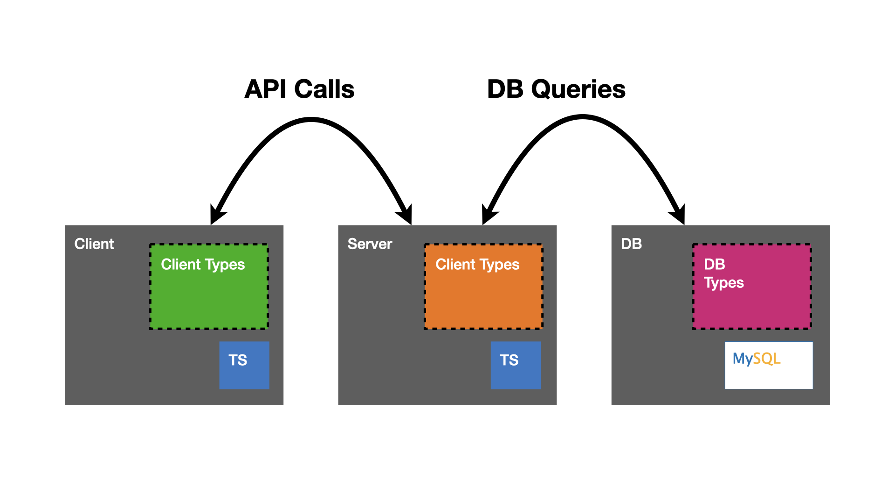
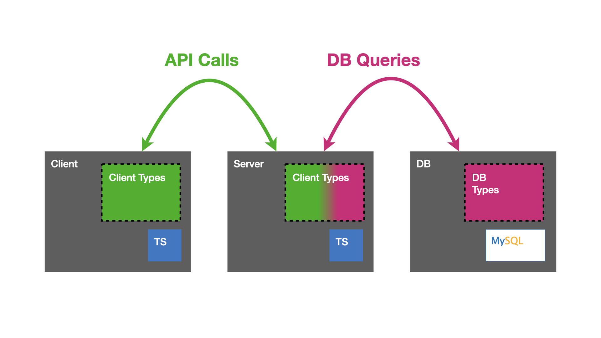

## What does "full stack typing" look like?

TS is great, and gives us a lot of confidence around safety and refactoring where type-checking takes place.

…but where does it NOT take place? _Anywhere outside of our JS code, at runtime_

**If you believe in the value proposition that TS offers in `.ts` files, the same benefits should hold true for what we’re talking about today.**

Let’s imagine a TS react app with a TS node server, and a relational DB of some sort

We enjoy well defined types in client-side code, server-side code, and in our DB schema. However **without doing some significant extra work, these may all be islands of independent type information.**

Note that **we may get no type safety across API calls.** It's possible for things to happen at runtime that are hard to predict and manage. Refactoring requires some significant vigilance!

In particular, let's look at a couple of dangerous spots where we lack type checking

- `fetch('/api/*')`
  - The payload sent to the API from a client
  - The payload returned to the client from the API
- `sql.query('SELECT * from things')` (or some other equivalent thing)
  - The query sent to the DB
  - The result set returned to the API from the DB

In this workshop, we’re going to be talking all about changing our scenario into something that looks more like this:

In this world, we have the "green types" (let's call this "client representation")
helping us in the client, along the API call, and even in some business logic on the sever.

The "purple types" (let's call this the "db representation") are also visible on the server
and also the DB. If we imagine a world where we _almost never handwrite DB queries_, we can also get some benefits
of refactoring safety along API-to-DB communication.

## The Scenario We'll Explore

There are multiple approaches we could take to arrive at this outcome, and we’ll talk more than one of them because there are some important trade-offs to consider. We'll spend most of our time diving deep into my preferred setup (in my opinion, the one that's most likely to work for you).

- **We’ll use TypeScript to write all of our code**, although we will consider and discuss how things would work if our BE was written in another PL
- **We’ll use GraphQL as our “API query language and wire format”**. Other options like falcor exist, but the graphql ecosystem is rich and makes our life easy (think: vscode and browser extensions, etc…)
- **We’ll focus on using a very simple relational DB**. There are many good choices for databases, and many of them have great type systems, but exploring deeply into this is beyond the scope of this course.

There are two main schools of thought around how to have a single source of truth for your types in one place

### "The Schema"

We will spend almost all of our time talking about this kind of setup

A single source of truth will be a GraphQL schema, and we’ll generate TypeScript code both for our UI and API.

Key tools: [graphqlgen](https://github.com/prisma-labs/graphqlgen), [graphql-code-generator](https://www.graphql-code-generator.com/), [apollo CLI codegen](https://github.com/apollographql/apollo-tooling#apollo-clientcodegen-output)

### "The Interfaces"

**We won't touch on this idea much, because the tooling around this setup is far less mature.**
Define TypeScript types for our “schema” and generate the GraphQL part using a tool.

Key tools: [type-graphql](https://github.com/MichalLytek/type-graphql), [Nest.js](https://docs.nestjs.com/graphql/quick-start)

However, first we need to learn a little bit about what GraphQL is, and the problems it solves
