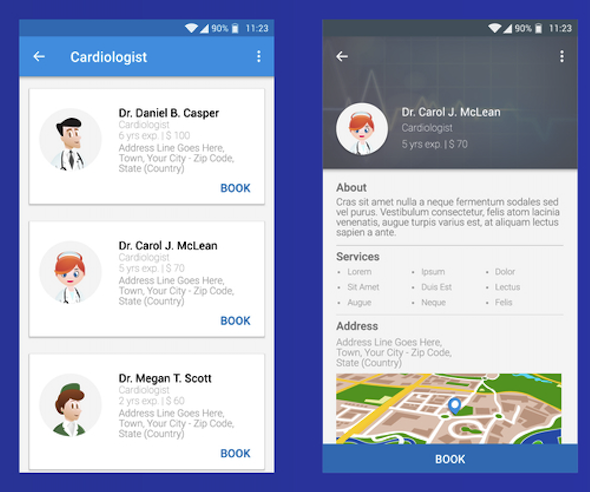

## A few problems that something like GQL solves

Let’s imagine we’re adding the a page to a hospital UI



Let’s imagine we already have some API endpoint for a weekly report that has way more detailed information about each doctor than we need for this table, but is missing the “availability” field.

We’d have a few choices about how to proceed

1. **Use the existing endpoint as-is**, except that we add the “availability” field
2. We could **build a new endpoint that gives us just the “availability” field**, and fetch it in parallel with a call to the existing endpoint.
3. **Build an entirely new endpoint that returns all of the data we need**, just for this new page
4. **Modify the existing endpoint so that it operates in multiple “modes”** (maybe depending on a queryParam?)

None of these seem ideal in the long term

If we go with (1) we’re going to end up with an ever-growing list of “doctor” fields. Some of these may also require new DB queries behind the scenes or send large amounts of unnecessary data over the wire, and we’ll pay that added price every time we need a list of doctors for any reason. This is sometimes referred to as over-fetching

If we go with (2) we’re going to end up with a bunch of tiny little supplemental API endpoints. Over time they’ll sort of “pile up” and it’ll be difficult to keep track of which one(s) are used and where. We may notice performance issues on client devices due to number of requests (HTTP/2 multiplexing mitigates this), more QPS hitting the API, and an increased tendency for race condition problems.

If we go with (3) we’re going to end up with an extremely complicated API, that significantly diverges from the RESTful model (which would seem to indicate that `GET /doctors` should be the single path where we get a list of doctors)

If we go with (4) we’ll introduce some non-trivial complexity to the endpoint itself, and introduce the need for more test cases. What happens when we have several orthogonal modes that all can be used in conjunction with each other?

```ts
levelOfDetail = { summary, detail, mediumSummary }
includeAvailability = { true, false }
includeSpecialization = { true, false }
```

We start to see that we’ll end up with N! scenarios to build, test and maintain

## Types & Fields

GraphQL schemas include a concept of types and fields. These can be thought of as TS interfaces.

Fields can be any GraphQL scalar type. Some of these will look familiar, and it’s possible to define new scalar types of your own if you like

## Queries

The way we ask for data with GraphQL is via a query

EXAMPLE: query with no arguments required

One of the key things to notice is that we’re only getting the fields back that we asked for. This looks like we’re avoiding the over-fetching and under-fetching problems!

## Arguments

Our first query was very simple – sometimes we need to provide some parameter to limit the subset of records returned to the
