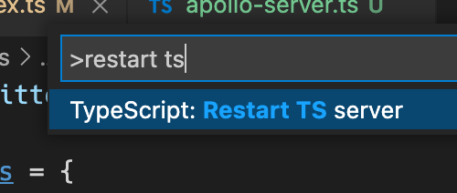

## The Types

From within the `./server` sub-project, run the following command

```sh
yarn codegen
```

You should see a new file appear with lots of types in it `server/src/resolvers-types.generated.ts`.

Sometimes after running this command, you may find you need to restart your TypeScript language server. In vscode you can do this
by opening any `.ts` file, and then running the `> Restart TS Server` command.



Go to `server/src/resolvers.ts` and import this new file, along with our "database utility"

```ts
import Db from "./db"
import { Resolvers } from "./resolvers-types.generated"
```

Add a return type annotation for `createResolvers`

```diff
- export function createResolvers() {
+ export function createResolvers(): Resolvers {
```

Next, go to the file with your query resolvers `server/src/resolvers/Query.ts`, and add this import

```ts
import { QueryResolvers } from "../resolvers-types.generated"
```

And a type annotation for the variable

```ts
const queryTwitterResolvers: QueryResolvers = {
```

Run your test query again, it should work.

Add some sample data to return from `suggestions()` instead of the empty array

```ts
return [
  {
    name: "TypeScript Project",
    handle: "TypeScript",
    avatarUrl: "http://localhost:3000/static/ts-logo.png",
    reason: "Because you follow @MichaelLNorth",
    id: "1",
  },
  {
    name: "jQuery",
    handle: "jquery",
    avatarUrl:
      "http://localhost:3000/static/jquery-logo.jpeg",
    reason: "Because you follow @FrontendMasters",
    id: "2",
  },
]
```

Everything should still type-check, but if you comment out some fields in these
objects you should get some feedback from the TS compiler.

## Context

There's one more thing that's convenient to do right now, and that's
provide a type for the context object that's created for every new request

Add this interface to `server/src/resolvers.ts`

```ts
import Db from "./db"

export interface TwitterResolverContext {
  db: Db
}
```

And pass it in as a typeparam to the resolver types

`server/src/resolvers.ts`

```diff
-const resolvers: Resolvers = {
+const resolvers: Resolvers<TwitterResolverContext> = {
```

`server/src/resolvers/Query.ts`

```diff
+import { TwitterResolverContext } from '../resolvers';
import { QueryResolvers } from '../resolvers-types.generated';

-const queryTwitterResolvers: QueryResolvers
+const queryTwitterResolvers: QueryResolvers<TwitterResolverContext>
```

One more place we can put this type is in `server/src/apollo-server.ts`

Just add the import

```ts
import {
  createResolvers,
  TwitterResolverContext,
} from "./resolvers"
```

And before creating the `ApolloServer`, create a new variable

```ts
const context: () => TwitterResolverContext = () => ({ db })
```

and pass it in when you create your `ApolloServer`

```diff
const server = new ApolloServer({
-    context: () => ({ db }),
+    context,
    schema: addResolversToSchema({
```

Next, let's get our React UI actually consuming some of this data, using a GraphQL client!
