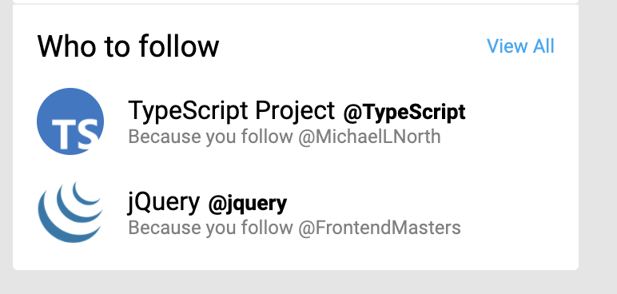

## Setting up the apollo client

The first thing we'll need to do is bring the apollo graphql client into the app. Open `client/src/index.tsx` and
add the following import

```ts
import {
  ApolloClient,
  ApolloProvider,
  InMemoryCache,
} from "@apollo/client"
```

Create an apollo client, immediately after the imports in top-level module scope

```ts
const client = new ApolloClient({
  uri: "http://localhost:3000/graphql",
  cache: new InMemoryCache(),
})
```

and finally, wrap the `<App />` component with an `<ApolloProvider>`

```diff
+   <ApolloProvider client={client}>
      <App />
+   </ApolloProvider>

```

## Our first "operation"

Open `client/src/App.tsx` and add these imports

```ts
import { gql } from "@apollo/client"
import { useGetCurrentUserQuery } from "./generated/graphql"
```

You may see some in-editor feedback telling you there's a problem with `'./generated/graphql'`. This is normal for now.

Next, add the following in top-level module scope

```ts
export const GET_CURRENT_USER = gql`
  query GetCurrentUser {
    currentUser {
      id
      name
      handle
      avatarUrl
      createdAt
    }
    suggestions {
      name
      handle
      avatarUrl
      reason
    }
  }
`
```

Inside the component, before the function returns a JSX node, add the following

```ts
const { loading, error, data } = useGetCurrentUserQuery()
if (loading) return <p>Loading...</p>
if (error) return <p>Error: {error}</p>
if (!data) return <p>No data.</p>
const { currentUser, suggestions = [] } = data
```

And wire up these new pieces of data `currentUser`, `suggestions` in two places

```diff
-  <LeftSidebar currentUser={CURRENT_USER} />
+  <LeftSidebar currentUser={{...CURRENT_USER, ...currentUser}} />
```

```diff
-  <RightBar trends={TRENDS} suggestions={SUGGESTIONS} />
+  <RightBar trends={TRENDS} suggestions={suggestions} />
```

Finally, it's time to generate the GraphQL code for the client.
From within the `./client` folder, run the following command

```sh
yarn codegen
```

You may need to restart your TS server and/or ESLint, but at this point when things settle
you should get no type errors

Now, visit [http://localhost:1234](http://localhost:1234) and you should see the twitter UI. You'll know
that your data is coming through because you'll see two "suggestion" items instead of one



Clean up any unused imports and variables (e.g., the `SUGGESTIONS` array in `App.tsx`) if you like.

Next, let's go back to our API, and get some data coming from our database coming all the way through to the UI.
