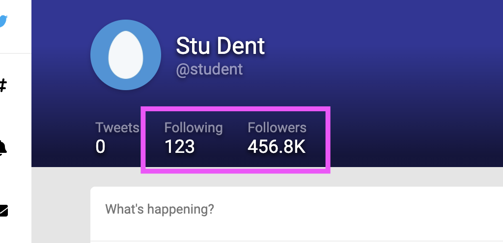

## Schema changes

Open `schema.graphql` and add the following types

```graphql
type UserStats {
  tweetCount: Int!
  followingCount: Int!
  followerCount: Int!
}
type Tweet {
  id: String!
  body: String!
  createdAt: String!
  updatedAt: String!
  author: User
  stats: TweetStats
}
type TweetStats {
  favoriteCount: Int!
  retweetCount: Int!
  commentCount: Int!
}
```

and make the following changes

```diff
type Query {
  currentUser: User!
  suggestions: [Suggestion!]!
+ tweets: [Tweet!]!
}
```

```diff
type User {
  id: String!
  name: String!
  handle: String!
  coverUrl: String!
  avatarUrl: String!
  createdAt: String!
  updatedAt: String!
+ stats: UserStats
}
```

Run `yarn codegen` in both the `client` and `server` folders to generate updated TypeScript types.

## Context Cache

We also need to set up some caches in our `context` object, to avoid the `N+1` DB query problem.

Open `server/src/apollo-server.ts` and make the following change

```diff
    context: () =>
      ({
        db,
+       dbTweetCache: {},
+       dbTweetToFavoriteCountMap: {},
+       dbUserCache: {},
      } as TwitterResolverContext),
```

and in your `server/src/resolvers.ts` add these new fields to the `TwitterResolverContext` interface

```ts
import Db, { DbTweet, DbUser } from "./db"

export interface TwitterResolverContext {
  db: Db
  dbTweetCache: Record<string, DbTweet>
  dbUserCache: Record<string, DbUser>
  dbTweetToFavoriteCountMap: Record<string, number>
}
```

## Resolvers and nested types

Create a file for simple "DB representation" -> "GraphQL representation" transforms `server/src/transforms.ts`

```ts
import { Tweet } from "./resolvers-types.generated"
import { DbTweet } from "./db"

export const tweetTransform = (
  t: DbTweet
): Omit<Tweet, "author"> => {
  return {
    id: t.id,
    body: t.message,
    createdAt: t.createdAt,
    updatedAt: t.updatedAt,
  }
}
```

In your `Query` resolver, `server/src/resolvers/Query.ts` add an import to your "transforms" file

```ts
import { tweetTransform } from "../transforms"
```

and a `tweets` function that uses it. Note that we're using our cache objects

```ts
tweets: (
  _,
  __,
  { db, dbTweetToFavoriteCountMap, dbUserCache, dbTweetCache }
) => {
  db.getAllUsers().forEach((user) => {
    dbUserCache[user.id] = user;
  });
  db.getAllFavorites().forEach((favorite) => {
    const count = dbTweetToFavoriteCountMap[favorite.tweetId] || 0;
    dbTweetToFavoriteCountMap[favorite.tweetId] = count + 1;
  });
  return db.getAllTweets().map((t) => {
    dbTweetCache[t.id] = t;
    return tweetTransform(t);
  });
},
```

Now use Apollo Explorer to try and run this query

```graphql
query GetTweets {
  currentUser {
    stats {
      followerCount
    }
  }
  tweets {
    body
    author {
      handle
    }
  }
}
```

Note that all the `tweet.author` fields have a `null` value, as does the `currentUser.stats` field.

We can address this with inner resolvers

## Inner resolvers

Create a new `User` resolver module `server/src/resolvers/User.ts`

```ts
import { TwitterResolverContext } from "../resolvers"
import { UserResolvers } from "../resolvers-types.generated"

const userTwitterResolver: UserResolvers<TwitterResolverContext> =
  {
    stats(user, _, { db }) {
      return {
        followingCount: 123,
        followerCount: 456789,
        tweetCount: db.getUserTweets(user.id).length,
      }
    },
  }

export default userTwitterResolver
```

and a `Tweet` resolver module `server/src/resolvers/Tweet.ts`

```ts
import { TwitterResolverContext } from "../resolvers"
import { TweetResolvers } from "../resolvers-types.generated"

const tweetTwitterResolver: TweetResolvers<TwitterResolverContext> =
  {
    author(tweet, _, { dbUserCache, dbTweetCache }) {
      const dbTweet = dbTweetCache[tweet.id]
      if (!dbTweet)
        throw new Error(
          "Attempted to find Tweet.author, but the tweet was not found in dbTweetCache"
        )
      const dbUser = dbUserCache[dbTweet.userId]
      if (!dbUser)
        throw new Error(
          "Attempted to find Tweet.author, but the tweet's author (a User) was not found in dbUserCache"
        )
      return dbUser
    },
    stats(tweet, _, { dbTweetToFavoriteCountMap }) {
      return {
        commentCount: 99,
        retweetCount: 1,
        favoriteCount:
          dbTweetToFavoriteCountMap[tweet.id] || 0,
      }
    },
  }

export default tweetTwitterResolver
```

Wire these resolvers up in your `server/src/resolvers.ts` file

```diff
+import tweetTwitterResolver from './resolvers/Tweet';
+import userTwitterResolver from './resolvers/User';

export function createResolvers(): Resolvers<TwitterResolverContext> {
  const resolvers = {
    Query: queryTwitterResolver,
+   Tweet: tweetTwitterResolver,
+   User: userTwitterResolver,
  };
  return resolvers;
}
```

## Consume it in the UI

We're going to make two frontend changes.

### Current User Stats

First, in `client/src/App.tsx`, add a new "stats" part to the `GET_CURRENT_USER` GraphQL operation

```diff
      avatarUrl
      createdAt
+     stats {
+       tweetCount
+       followingCount
+       followerCount
+     }
    }
    suggestions {
```

This should allow you to pass the `currentUser` value through to the `Header` component

```diff
-  <Header currentUser={CURRENT_USER} />
+  <Header currentUser={currentUser} />
```

Now you should see non-zero "follower count" and "following count" numbers for the currently logged in user



### Tweets

Open `client/src/Timeline.tsx` and add the following imports

```ts
import { gql } from "@apollo/client"
import { useGetTimelineTweetsQuery } from "./generated/graphql"
```

add a new query in top-level module scope

```ts
export const GET_TIMELINE_TWEETS = gql`
  query GetTimelineTweets {
    tweets {
      id
      body
      stats {
        favoriteCount
        retweetCount
        commentCount
      }
      createdAt
      author {
        name
        handle
        avatarUrl
      }
    }
  }
`
```

Because we created a new operation, we'll need to run `yarn codegen` within the `client` sub-project again
to get the new type information.

Within this component, before it returns, add this

```ts
const { loading, error, data } = useGetTimelineTweetsQuery()
if (loading) return <p>Loading...</p>
if (error) return <p>Error: {error}</p>
if (!data) return <p>No data!</p>
const { tweets } = data
if (!tweets) return <p>No tweets!</p>
```

And now instead of mapping over the fixture data array, use
the data that the GraphQL API returns

```diff
-  {TWEETS.map((t) => {
+  {tweets.map((t) => {
```

You can delete the `TWEETS` array if you like, we don't need it anymore.
You should see some new tweets in the feed now!
