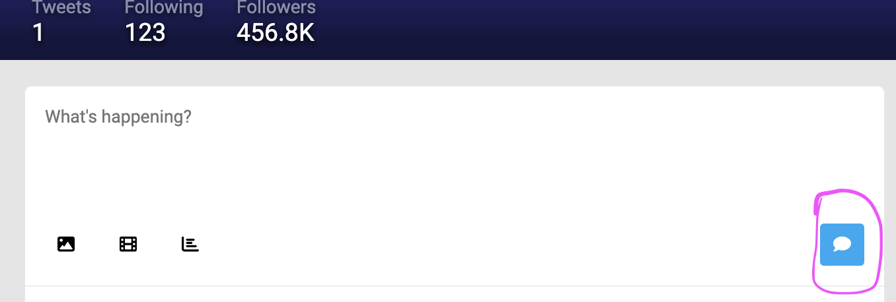

## Schema

Update your `graphql.schema` by adding the following

```graphql
type Mutation {
  createTweet(userId: String!, body: String!): Tweet!
}
```

Run `yarn codegen` in both the `client` and `server` sub-projects to get
updated TS types that include this mutation

## Mutation Resolver

Create a new dedicated file for your `Mutation` resolvers `server/src/resolvers/Mutation.ts`

```ts
import { tweetTransform } from "../transforms"
import { TwitterResolverContext } from "../resolvers"
import { MutationResolvers } from "../resolvers-types.generated"

const mutationTwitterResolver: MutationResolvers<TwitterResolverContext> =
  {
    async createTweet(_parent, args, { dbTweetCache, db }) {
      const { body, userId } = args
      const dbTweet = await db.createTweet({
        message: body,
        userId,
      })
      const dbTweetMap = (dbTweetCache ||= {})
      dbTweetMap[dbTweet.id] = dbTweet
      return tweetTransform(dbTweet)
    },
  }

export default mutationTwitterResolver
```

and in `server/src/resolvers.ts` add it to the main resolver object

```diff
+import mutationTwitterResolver from './resolvers/Mutation';

  const resolvers = {
    Query: queryTwitterResolver,
+   Mutation: mutationTwitterResolver,
    Tweet: tweetTwitterResolver,
```

## Compose Panel

Open the Compose Panel component `client/src/ComposePanel.tsx` and add the
following imports

```ts
import { gql } from "@apollo/client"
import { useCreateNewTweetMutation } from "./generated/graphql"
```

Add this new query to top-level module scope

```ts
export const CREATE_NEW_TWEET = gql`
  mutation CreateNewTweet(
    $userId: String!
    $body: String!
  ) {
    createTweet(userId: $userId, body: $body) {
      id
    }
  }
`
```

delete the entire existing `createNewTweet` function and replace it with

```ts
const [createNewTweet, { error }] =
  useCreateNewTweetMutation()
if (error) return <p>Error creating new tweet: {error}</p>
```

and make this change to the `handleSubmit` function

```diff
-   createNewTweet(body);
-   textarea.value = '';
+   createNewTweet({
+     variables: { userId: currentUser.id, body }}).then(() => {
+       textarea.value = '';
+     })
+     .catch((err: unknown) => {
+       console.error('Problem creating new tweet', err);
+     });
```

Try creating a new tweet, pressing the blue button to send the API call



**There's a bug!** Nothing happens in the UI when new tweets are created.
However, if you refresh the page, you can see that the data actually ends up
being persisted.

## Bug Fix

We need to tell apollo that the `GET_TIMELINE_TWEETS` query
needs to be re-fetched when we click the "create tweet" button

This is quick and easy with Apollo

In `client/src/ComposePanel.tsx` import the query we want to refresh

```ts
import { GET_TIMELINE_TWEETS } from './Timeline';
```

And then make the following change to the invocation of `createNewTweet`

```diff
    createNewTweet({
      variables: { userId: currentUser.id, body },
+     refetchQueries: [GET_TIMELINE_TWEETS],
    }).then(() => {
```

Try to create a new tweet again. It should work now!
