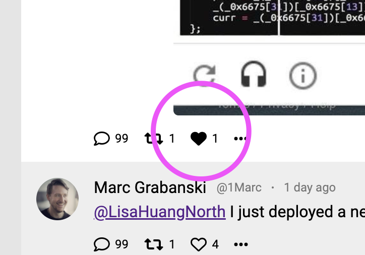

## Schema

Update your `graphql.schema` by adding the following

```graphql
type Favorite {
  id: String!
  tweet: Tweet!
  user: User!
  createdAt: String!
  updatedAt: String!
}
```

and add a `favorites` field to the `User` type

```graphql
  favorites: [Favorite!]
```

In `client/src/App.tsx` update the current user query to include a `favorites` field

```diff
    currentUser {
      id
      name
      handle
      avatarUrl
      createdAt
      stats {
        tweetCount
        followingCount
        followerCount
      }
+     favorites {
+       tweet {
+         id
+       }
+     }
    }
    suggestions {
      name
```

Run `yarn codegen` in both the `client` and `server` sub-projects to get
updated TS types that include this change to the schema and query

## Backend

In `server/src/transforms.ts` add a new transform function

```ts
import { DbFavorite } from "./db"
import { Favorite } from "./resolvers-types.generated"

export const favoriteTransform = (
  t: DbFavorite
): Omit<Favorite, "user" | "tweet"> => {
  return {
    id: t.id,
    createdAt: t.createdAt,
    updatedAt: t.updatedAt,
  }
}
```

import it into your `User` resolvers `server/src/resolvers/User.ts`,
and use it to add a new `favorites()` function

```ts
import {
  favoriteTransform,
  tweetTransform,
} from "../transforms"
```

```ts
  favorites(user, _, { db }) {
    const faves = db.getUserFavorites(user.id);
    return faves.map((f) => {
      return {
        ...favoriteTransform(f),
        user,
        tweet: tweetTransform(db.getTweetById(f.tweetId)),
      };
    });
  },
```

## UI

Go back to `client/src/App.tsx`, and replace all occurrences of `CURRENT_USER` with `currentUser`.

Be careful with this change -- you can eliminate the merge of the objects entirely

```diff
-<LeftSidebar currentUser={{...CURRENT_USER, ...currentUser}} />
+<LeftSidebar currentUser={currentUser} />
```

You may also need to reorganize a few lines of code so that **variables are only used after they're declared**

If everything is working properly, you'll see that one tweet in the feed is already "liked"


