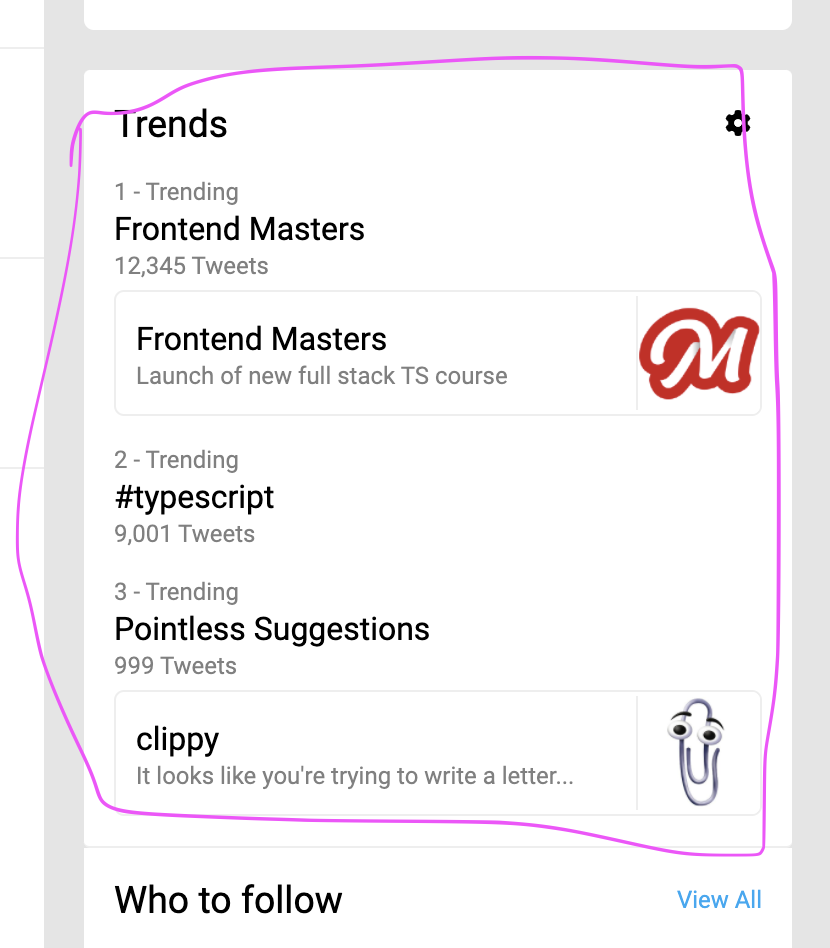

## Schema

Update your `graphql.schema` by adding the following

```graphql
type HashtagTrend {
  hashtag: String!
  tweetCount: Int!
}
type TopicTrendQuote {
  title: String!
  description: String!
  imageUrl: String!
}
type TopicTrend {
  topic: String!
  tweetCount: Int!
  quote: TopicTrendQuote
}
union Trend = TopicTrend | HashtagTrend
```

and add add a new top-level query

```diff
type Query {
+ trends: [Trend!]!
}
```

In `client/src/App.tsx` add the following to the `GET_CURRENT_USER` query

```ts
trends {
  ... on TopicTrend {
    tweetCount
    topic
    quote {
      title
      imageUrl
      description
    }
  }
  ... on HashtagTrend {
    tweetCount
    hashtag
  }
}
```

Run `yarn codegen` in both the `client` and `server` sub-projects to get
updated TS types that include this change to the schema and query

## Server

Create a new transform for this `Trend` object in `server/src/transforms.ts`

```ts
import { DbTrend } from "./db"
import { Trend } from "./resolvers-types.generated"

export const trendTransform = (t: DbTrend): Trend => {
  const { tweetCount } = t
  if (t.kind === "topic") {
    const { topic, quote } = t
    return { tweetCount, topic, quote }
  } else {
    const { hashtag } = t
    return { tweetCount, hashtag }
  }
}
```

And add the new top-level Query resolver in `server/src/resolvers/Query.ts`

```ts
import { trendTransform } from "../transforms"
```

```ts
  trends: (_, __, { db }) => {
    return db.getAllTrends().map(trendTransform);
  },

```

Create a new `Trend` resolver module `server/src/resolvers/Trend.ts`

```ts
import { TwitterResolverContext } from "../resolvers"
import { TrendResolvers } from "../resolvers-types.generated"

const trendTwitterResolver: TrendResolvers<TwitterResolverContext> =
  {
    __resolveType(obj, _context, _info) {
      // Only Author has a name field
      // eslint-disable-next-line @typescript-eslint/no-unsafe-member-access, @typescript-eslint/no-explicit-any
      if (typeof (obj as any).hashtag === "string") {
        return "HashtagTrend"
      } else return "TopicTrend"
      return null // GraphQLError is thrown
    },
  }

export default trendTwitterResolver
```

and import it into `server/src/resolvers.ts`, adding it to the exported object

```ts
import TwitterTrendResolver from "./resolvers/Trend"
```

```diff
  Tweet: tweetTwitterResolver,
  User: userTwitterResolver,
+ Trend: trendTwitterResolver,
```

## UI

In `client/src/App.tsx` use destructured assignment to grab `trends`

```diff
-  const { currentUser, suggestions = [] } = data;
+  const { currentUser, suggestions = [], trends = [] } = data;
```

Add this line before the function returns

```ts
const filteredTrends = trends.filter(isDefined)
```

```diff
-  <RightBar trends={TRENDS} suggestions={suggestions} />
+  <RightBar trends={filteredTrends} suggestions={suggestions} />
```

You'll know that everything is working if you see additional "trending things" in the right sidebar of the UI


