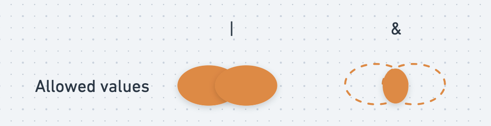
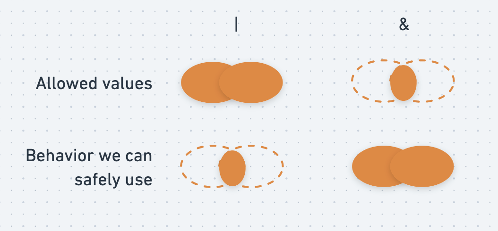

## Union and Intersection Types, Conceptually

Union and intersection types can conceptually be thought of as logical boolean operators
(`AND`, `OR`) as they pertain to types. Here are a couple of example sets we'll use for this discussion

```py
Evens = { 2, 4, 6, 8 }
OneThroughFive = { 1, 2, 3, 4, 5 }
```


### Union types `|`

A union type can be thought of as **`OR`, for types**, and TypeScript uses the pipe (`|`)
symbol to represent the **Union type operator**

Using the example above, if we wanted to find `OneThroughFive | Evens` we'd combine all the members
of the `OneThroughFive` set and all of the members of the `Evens` set.

```py
OneThroughFive | Evens => { 1, 2, 3, 4, 5, 6, 8 }
```

If you think about the assumptions we could make about a member of this set at random, we couldn't
be sure whether it's between 1 and 5, and we couldn't be sure whether it's odd.

### Intersection types `&`

An intersection type can be thought of as **`AND`, for types**, and TypeScript uses the ampersand (`&`)
symbol to represent the **Intersection type operator**

Using the example again, if we wanted to find `OneThroughFive & Evens` we'd find all members that the
`OneThroughFive` and `Evens` sets have in common

```py
OneThroughFive & Evens => { 2, 4 }
```



## Union Types in TypeScript

Let's think back to the concept of literal types from an earlier example

```ts twoslash
const humidity = 79
//     ^?
```

If we wanted to create a union type that represented the set `{ 1, 2, 3, 4, 5 }` we could do it using
the `|` operator. We can also use the `type` keyword to give this type a name (we'll talk more about
this in the next chapter)

```ts twoslash
// @errors: 2322
type OneThroughFive = 1 | 2 | 3 | 4 | 5
//   ^?
let lowNumber: OneThroughFive = 3
//   ^?
lowNumber = 8
```

and we could create another type called `Evens` to represent the set `{ 2, 4, 6, 8 }`

```ts twoslash
// @errors: 2322
type Evens = 2 | 4 | 6 | 8
//    ^?
let evenNumber: Evens = 2;
//    ^?
evenNumber = 5;
```

Explicitly creating the union type is now simple

```ts twoslash
type OneThroughFive = 1 | 2 | 3 | 4 | 5
type Evens = 2 | 4 | 6 | 8
/// ---cut---
let evenOrLowNumber = 5 as Evens | OneThroughFive;
//         ^?
```

Union types often appear where control flow can produce a different value for different code paths.

For example, the `flipCoin()` function will return `"heads"` if a number selected
from `(0, 1)` is >= 0.5, or `"tails"` if <=0.5.

```ts twoslash
function flipCoin() {
  if (Math.random() > 0.5) return "heads" // the "heads" branch
  return "tails" // the "tails" branch
}

const outcome = flipCoin()
//     ^?
```

Let's make this a bit more interesting by using tuples, that is structured as follows:

- `[0]` either `"success"` or `"failure"`
- `[1]` something different, depending on the value found in `[0]`
  - `"success"` case: a piece of contact information: `{ name: string; email: string; }`
  - `"error"` case: an `Error` instance

```ts twoslash
const success = ["success", { name: "Mike North", email: "mike@example.com"} ] as const
//     ^?
const fail = ["error", new Error("Something went wrong!") ] as const
//     ^?
```

We'll still decide which of these things actually happens based on our 50/50 coin flip from above

```ts twoslash
function flipCoin() {
  if (Math.random() > 0.5) return "heads"
  return "tails"
}
const success = ["success", { name: "Mike North", email: "mike@example.com"} ] as const
const fail = ["error", new Error("Something went wrong!") ] as const
/// ---cut---
function maybeGetUserInfo() {
  if (flipCoin() === "heads") {
    return success
  } else {
    return fail
  }
}

const outcome2 = maybeGetUserInfo()
//     ^?
```

this type is significantly more interesting.

### Working with union types

Let's continue with our example from above and attempt to do something with the
"outcome" value.

First, let's destructure the tuple and see what TypeScript has to say about its members

```ts twoslash
function flipCoin() {
  if (Math.random() > 0.5) return "heads"
  return "tails"
}
const success = ["success", { name: "Mike North", email: "mike@example.com"} ] as const
const fail = ["error", new Error("Something went wrong!") ] as const

function maybeGetUserInfo() {
  if (flipCoin() === "heads") {
    return success
  } else {
    return fail
  }
}
/// ---cut---
const outcome2 = maybeGetUserInfo()

const [first, second] = outcome2
first
// ^?
second
// ^?
```

[[info | :bulb: A good time to poke around]]
| Click the `Try` button and explore `first` and `second` in the TS playground.
| Explore what's available in the autocomplete for each.

```ts twoslash
// @noErrors
function flipCoin() {
  if (Math.random() > 0.5) return "heads"
  return "tails"
}
const success = ["success", { name: "Mike North", email: "mike@example.com"} ] as const
const fail = ["error", new Error("Something went wrong!") ] as const

function maybeGetUserInfo() {
  if (flipCoin() === "heads") {
    return success
  } else {
    return fail
  }
}
/// ---cut---
const outcome2 = maybeGetUserInfo()
const [first, second] = outcome2
first.s
//     ^|
second.n
//      ^|
```

We can see that the autocomplete information for the first value suggests that it's
a string. This is because, regardles of whether this happens to be the specific `"success"`
or `"error"` string, it's definitely going to be a string.

The second value is a bit more complicated -- only the `name` property is available to us.
This is because, both our "user info object, and instances of the `Error` class have a `name`
property whose value is a string.

Let's also look at our previous example involving `{1,2,3,4,5} | {2,4,6,8}` and consider how these `AND` and `OR` type operators describe the set of possible values, and the assumptions we can make about any given value in the set

```ts twoslash
// @errors: 2345 2322
type OneThroughFive = 1 | 2 | 3 | 4 | 5
type Evens = 2 | 4 | 6 | 8
/// ---cut---
function printEven(even: Evens): void {}
function printLowNumber(lowNum: OneThroughFive): void {}
function printEvenNumberUnder5(num: 2 | 4): void {}
function printNumber(num: number): void {}

let x = 5 as Evens | OneThroughFive;

// What does Evens | OneThroughFive accept as values?
let evenOrLowNumber: Evens | OneThroughFive;
evenOrLowNumber = 6 //✔️ An even
evenOrLowNumber = 3 //✔️ A low number
evenOrLowNumber = 4 //✔️ A even low number


// What requirements can `Evens | OneThroughFive` meet?
printEven(x)
printLowNumber(x)
printEvenNumberUnder5(x)
printNumber(x)
```

There's some interesting asymmetry at play here. A `Evens | OneThroughFive` can accept a wide range of values, but because allows for this flexibility, it doesn't meet the type-checking requirements for most of the `print*` functions.

> *Essentially, **`|` means "anything in either set" in terms of the allowed values**, and because of this **only the behavior that's definitely present on every member of both sets is available to us**

### Narrowing with type guards

Ultimately, we need to "separate" the two potential possibilities for our value, or
we won't be able to get very far. We can do this with [type guards](https://www.typescriptlang.org/docs/handbook/2/narrowing.html).

> Type guards are expressions, which when used with control flow statement, allow us to
> have a more specific type for a particular value.

I like to think of these as "glue" between the compile time type-checking and runtime
execution of your code. We will work with one that you should already be familiar with
to start: `instanceof`.

```ts twoslash
function flipCoin(): "heads" | "tails" {
  if (Math.random() > 0.5) return "heads"
  return "tails"
}
const success = ["success", { name: "Mike North", email: "mike@example.com"} ] as const
const fail = ["error", new Error("Something went wrong!") ] as const

function maybeGetUserInfo() {
  if (flipCoin() === "heads") {
    return success
  } else {
    return fail
  }
}
/// ---cut---
const outcome = maybeGetUserInfo()
const [first, second] = outcome
//            ^?
if (second instanceof Error) {
  // In this branch of your code, second is an Error
  second
  // ^?
} else {
  // In this branch of your code, second is the user info
  second
  // ^?
}
```

TypeScript has a special understanding of _what it means_ when our `instanceof`
check returns `true` or `false`, and creates a branch of code that handles each
possibility.

It gets even better...

### Discriminated Unions

```ts twoslash
function flipCoin(): "heads" | "tails" {
  if (Math.random() > 0.5) return "heads"
  return "tails"
}
const success = ["success", { name: "Mike North", email: "mike@example.com"} ] as const
const fail = ["error", new Error("Something went wrong!") ] as const

function maybeGetUserInfo() {
  if (flipCoin() === "heads") {
    return success
  } else {
    return fail
  }
}
/// ---cut---
const outcome = maybeGetUserInfo()
const [first, second] = outcome

if (first === "error") {
  // In this branch of your code, second is an Error
  second
  // ^?
} else {
  // In this branch of your code, second is the user info
  second
  // ^?
}
```

TypeScript understands that the first and second positions of our tuple are linked.
What we are seeing here is sometimes referred to as a [discriminated or "tagged" union type](https://en.wikipedia.org/wiki/Tagged_union).

## Intersection Types in TypeScript

Intersection types in TypeScript can be described using the `&` (ampersand) operator.

Let's look again at our example using sets of numbers

```ts twoslash
// @errors: 2345 2322
type OneThroughFive = 1 | 2 | 3 | 4 | 5
type Evens = 2 | 4 | 6 | 8

/// ---cut---
function printEven(even: Evens): void {}
function printLowNumber(lowNum: OneThroughFive): void {}
function printEvenNumberUnder5(num: 2 | 4): void {}
function printNumber(num: number): void {}

let y = 4 as Evens & OneThroughFive;
//  ^?

// What does Evens & OneThroughFive accept as values?
let evenAndLowNumber: Evens & OneThroughFive;
evenAndLowNumber = 6 //✔️ An even
evenAndLowNumber = 3 //✔️ A low number
evenAndLowNumber = 4 //✔️ A even low number

// What requirements can `Evens & OneThroughFive` meet?
printEven(y)
printLowNumber(y)
printEvenNumberUnder5(y)
printNumber(y)
```

Again, we see some degree of asymmetry, but it's almost like it's in the opposite direction compared to union types. The intersection type can accept a very narrow range of values, but because of this, it can meet the type-checking requirements of all four `print*` functions.

> Essentially, **`&` means "anything that is in both sets" in terms of the allowed values**, and because of this, we can use **"any of the behavior definitely present on members of _either_ set".**




It is _far_ less common to use intersection types compared to union types. I expect
it to be at least a 50-to-1 ratio for you in practice. A real-world case where you'll find
(and appreciate) an intersection type is [`Object.assign(a, b)`](https://developer.mozilla.org/en-US/docs/Web/JavaScript/Reference/Global_Objects/Object/assign)
