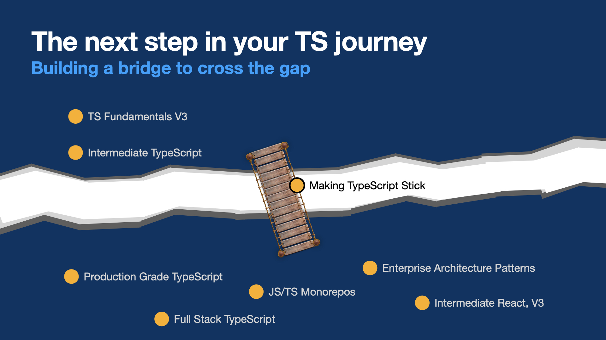
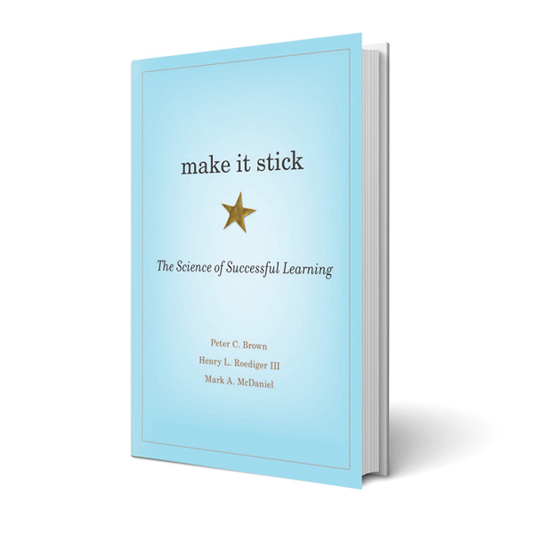

## What to expect

Aside from a small update on the latest developments in the TS language,
**we won't be covering much _new material_, but we'll get a lot of valuable
practice** that will help you better retain knowledge and apply it to the
problems you encounter in the real world.

## But why practice?

Getting started with TypeScript is one thing, but there's a big gap between
learning the particulars of the language and practical application of the more
advanced topics that follow

## Inspiration

We'll be applying some of the techniques described in _Making it Stick_, a popular
book on the science of learning, retention, and application of learned knowledge.

How will we go about this? What makes this different from the _exercise portion_
of courses you may have already taken?

- We'll tackle some very challenging exercises. There's evidence in studies
  "desirable difficulty" in learning improves retention
- We'll learn in a bunch of different ways, and in a fairly non-linear way
- We'll balance between rule-driven and example driven learning approaches

## How to take this course

- If possible **space this course out over a few days or weeks**. There's some
  evidence that "spacing" improves retention by as much as 90% compared to "cramming".
- **Keep a journal as part of owning your learning path**. Be aware of which
  topics you still find challenging, and which ones you feel you've already mastered
- **Make sure that you actually participate in the exercises and challenges**.
  Active participation will greatly increase the benefit of this course in your
  ability to form a solid mental model around TypeScript.
- **Be kind to yourself**, and try to frame "wrong answers" as learning opportunities
