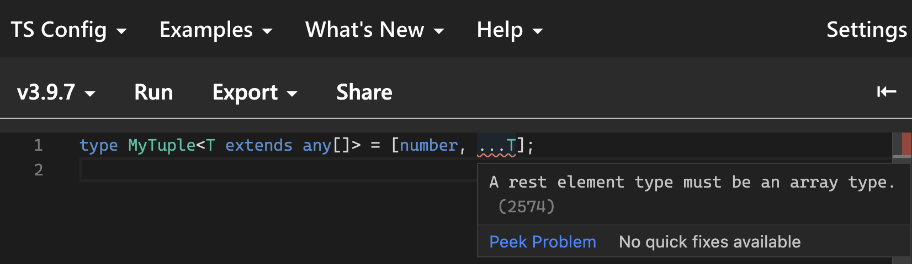
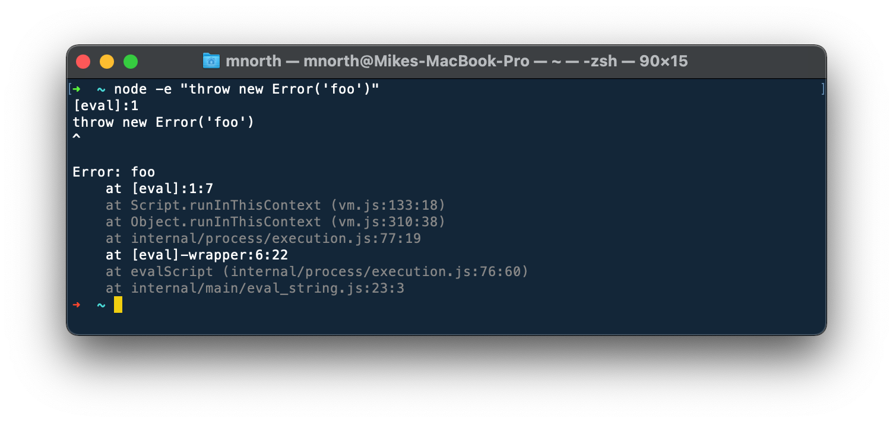
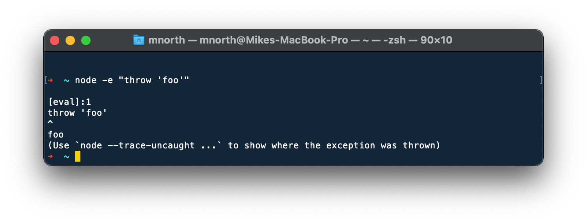

## Variadic Tuple Types

We know that a tuple type is an ordered collection (often of known length),
with the type of each member known as well.

```ts twoslash
type Color = [
  number, // red (0-255)
  number, // green (0-255)
  number // blue (0-255)
]
```

For a while, it's also been possible to use a `...spread[]` as the last
element of the tuple

```ts twoslash
// @errors: 2322
// Worked this way, even before TS 4.x
enum Sandwich {
  Hamburger,
  VeggieBurger,
  GrilledCheese,
  BLT
}
type SandwichOrder = [
  number, // order total
  Sandwich, // sandwich
  ...string[] // toppings
]

const order1: SandwichOrder = [12.99, Sandwich.Hamburger, "lettuce"]
const order2: SandwichOrder = [14.99, Sandwich.Hamburger, "avocado", "cheese"]
const order_with_error: SandwichOrder = [
  10.99,
  "lettuce"
]
```

It has even been possible to use generics for that spread type
at the end of the tuple

```ts twoslash
// @errors: 2322
// Worked this way, even before TS 4.x
type MyTuple<T> = [number, ...T[]]

const x1: MyTuple<string> = [4, "hello"]
const x2: MyTuple<boolean> = [4, true]
```

It's important to note that, before TS 4.0 we had to use `...T[]`, and could not
do something like this ([example in TS playground](https://www.typescriptlang.org/play?ts=3.9.7#code/C4TwDgpgBAsiAqBXMAbCAeeUIA9gQDsATAZygEMCQBtAXQD4oBeKagxAWwCMIAnAGigA6EfFoBuALAAoIA))



Why does this matter? Let's look at this example

```ts twoslash
enum Sandwich {
  Hamburger,
  VeggieBurger,
  GrilledCheese,
  BLT
}
type SandwichOrder = [
  number, // order total
  Sandwich, // sandwich
  ...string[] // toppings
]

const order1: SandwichOrder = [12.99, Sandwich.Hamburger, "lettuce"]

/**
 * return an array containing everything except the first element
 */
function tail<T>(arg: readonly [number, ...T[]]) {
  const [_ignored, ...rest] = arg
  return rest
}

const orderWithoutTotal = tail(order1)
//     ^?
```

This is not ideal. A `(string | Sandwich)[]` is not the same thing as a `[Sandwich, ...string[]]`.
What we're seeing here is what happens when TS tries to infer the following

```ts
T[]   <-----> [Sandwich.Hamburger, "lettuce"]
```

similar to what you'd see here

```ts twoslash
enum Sandwich {
  Hamburger,
  VeggieBurger,
  GrilledCheese,
  BLT
}
// ---cut---
function returnArray<T>(arg: readonly T[]): readonly T[] {
  return arg
}
const arr = [Sandwich.Hamburger, "lettuce"] as const
//     ^?
const result = returnArray(arr)
//     ^?
```

What we want instead for our tuple scenario, something like this

```ts twoslash
enum Sandwich {
  Hamburger,
  VeggieBurger,
  GrilledCheese,
  BLT
}
// ---cut---
function returnArray<T extends any[]>(arg: T): T {
  return arg
}
const arr: [Sandwich.Hamburger, "lettuce"] = [Sandwich.Hamburger, "lettuce"]
//     ^?
const result = returnArray(arr)
//     ^?
```

Inference is doing a lot more for us here, and I would argue, **we're no longer
losing type information**, once `T = [Sandwich.Hamburger, "lettuce"]`

TS 4.0 introduces support for _variadic tuples_. This relaxes the limitation
shown above, and allows us to use `...T` in tuple types. Going back to our `tail`
example, let's make a small change

```diff

-function tail<T>(arg: readonly [number, ...T[]]) {
+function tail<T extends any[]>(arg: readonly [number, ...T]) {
  const [_ignored, ...rest] = arg;
  return rest;
}
```

```ts twoslash
enum Sandwich {
  Hamburger,
  VeggieBurger,
  GrilledCheese,
  BLT
}
type SandwichOrder = [
  number, // order total
  Sandwich, // sandwich
  ...string[] // toppings
]


// ---cut---
/**
 * return an array containing everything except the first element
 */
function tail<T extends any[]>(
  arg: readonly [number, ...T]
) {
  const [_ignored, ...rest] = arg
  return rest
}
const order1: SandwichOrder = [12.99, Sandwich.Hamburger, "lettuce"]

const result = tail(order1)
//     ^?
```

There we go! This improved degree of inference now works for us _inside the tuple_!

We can also now use more than one `...spread` in a single tuple

```ts twoslash
type MyTuple = [
  ...[number, number],
  ...[string, string, string]
]
const x: MyTuple = [1, 2, "a", "b", "c"]
//    ^?
```

It's important to note that **only one `...rest[]` element is possible in a given
tuple, but it doesn't necessarily have to be the last element**

```ts twoslash
// @errors: 1265
type YEScompile1 = [...[number, number], ...string[]]
type NOcompile1 = [...number[], ...string[]]

type YEScompile2 = [boolean, ...number[], string]
```

Check out [how this feature has allowed the Rx.js project to simplify their types](https://github.com/ReactiveX/rxjs/pull/5859/files)

## Class Property Inference from Constructors

This major convenience feature reduces the need for class
field type annotations by inferring their types from
assignments in the `constructor`. It's important to remember
that this only works when `noImplicitAny` is set to `true`.

```ts twoslash
class Color {
  red  // :number no longer needed!
  // ^?
  green // :number no longer needed!
  blue // :number no longer needed!
  constructor(c: [number, number, number]) {
    this.red = c[0]
    this.green = c[1]
    this.blue = c[2]
  }
}
```

## Thrown values as unknown

Before TS 4.0, thrown values were always considered to be of type
`any`. Now, we can choose to regard it as of type `unknown`.
If you've ever found it risky to assume that a `message`, `stacktrace`,
or `name` property is on every possible thrown value you encounter
in a catch clause, this feature may make help you sleep a little more soundly.

Thrown errors provide a nice stack trace


Whereas thrown values of other types (e.g., `string`) often provide far less
information


**I advise always typing errors as `unknown`**, and can't think of any scenario
where it would be worse than an `any`.

```ts twoslash
function somethingRisky() {}
// ---cut---
try {
  somethingRisky()
} catch (err: unknown) {
  if (err instanceof Error) throw err
  else throw new Error(`${err}`)
}
```

There's also a `useUnknownInCatchVariables` `compilerOption` flag that
will make thrown values unknown across your entire project

## Template literal types

You can think of these like **template strings, but for types**.

```ts twoslash
type Statistics = {
  [K in `${"median" | "mean"}Value`]?: number
}
const stats: Statistics = {}
stats.meanValue
//     ^|
```

You can do some pretty interesting things with these

```ts twoslash
let winFns: Extract<keyof Window, `set${any}`> = "" as any
//      ^?
```

We even get some special utility types to assist with changing case

```ts twoslash
type T1 = `send${Capitalize<"mouse" | "keyboard">}Event`
//   ^?
type T2 = `send${Uppercase<"mouse" | "keyboard">}Event`
//   ^?
type T3 = `send${Lowercase<"Mouse" | "keyBoard">}Event`
//   ^?
```

## Key remapping in mapped types

You may recall that mapped types are kind of like our "for loop"
to build up an object type by key-value pairs. Before TS 4.1,
our ability to transform keys was very limited (usually involving an
explicit "old key to new key mapping")

We now have some new syntax (note the `as` in the example below) that
lets us transform keys in a more declarative way. This language
feature works quite nicely with template literal types

```ts twoslash {3}
type Colors = "red" | "green" | "blue"
type ColorSelector = {
  [K in Colors as `select${Capitalize<K>}`]: () => void
}
const cs: ColorSelector = {} as any
cs.selectRed()
//     ^|
```

## Checked index access

If you've ever heard me rant about typing Dictionaries, you may recall that
**my advice to describe them as having a possibility of holding `undefined` under some keys**

```ts twoslash
// Mike thinks this is way too optimistic
type Dict<T> = { [K: string]: T }

const d: Dict<string[]> = {}
d.rhubarb.join(", ") // 💥
```

My advice was to explicitly type it as

```ts twoslash
// @errors: 2532 18048
type Dict<T> = { [K: string]: T | undefined }
const d: Dict<string[]> = {}
d.rhubarb.join(", ") // 💥
```

Great, now we see an error alerting us to the ~possibility~ certainty that
there is no `string[]` stored under the `rhubarb` key.

However, it's tough to be vigilant enough to remember to do this to every
index signature in your entire app.

TypeScript now gives us a compiler flag that will do this for us: `noUncheckedIndexAccess`.

Sadly we can't demonstrate how this works using these docs yet, but [here's an example from the typescript playground](https://www.typescriptlang.org/play?noUncheckedIndexedAccess=true#code/PTAEFkEsGsFNQC4AtIDtoGdEq5LB3AQwE9EB7M0MgBwUgFs86BjAKAWOvgBFJmEAPABUAfKAC8oAN6gA2gGkAXKAwIATmgDmAXWVDQAX1atmZVKtAATZb34DVG1JtnaxkqUcsA6NUgCuAEaEagFeAFZkaAAUAEQANKAxAJSgIKCAvBuApTtAA)
